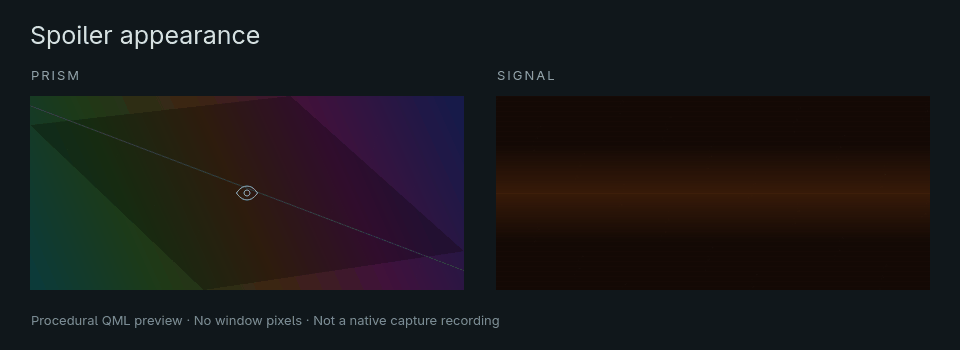

# Hyprveil for Omarchy

**Capture privacy, directly from your bar.**

Keep a window visible on your own screen while its compositor capture gets
a soft animated spoiler, a black mask, or no window at all. One click controls
the focused window; a small panel controls the look.

<p align="center">
  
</p>

*Left: actual Hyprveil native capture of a synthetic notes fixture. Right:
the real Omarchy panel rendered offscreen with synthetic state.*

<p align="center">
  <a href="https://github.com/OBJLAKO/omarchy-hyprveil/actions/workflows/tests.yml"></a>
  <a href="LICENSE"></a>
  
</p>

## Why two projects?

| Project | What it does |
| :--- | :--- |
| [**omarchy-hyprveil**](https://github.com/OBJLAKO/omarchy-hyprveil) — this repository | The Omarchy bar widget, confirmed privacy indicator and appearance controls. |
| [**hyprveil**](https://github.com/OBJLAKO/hyprveil) — required companion | The native Hyprland capture engine, CLI and Lua settings. Also works on plain Hyprland. |

The widget uses the native core's public API. Install the core once, then
manage capture privacy from Omarchy. You can star the
[panel](https://github.com/OBJLAKO/omarchy-hyprveil) and
[native core](https://github.com/OBJLAKO/hyprveil) to follow their independent releases.

## Install

Requires an Omarchy shell with third-party bar plugins, **native Hyprveil
0.4.0**, Python 3 and `hyprctl`. The native preview release is tested against
**Hyprland 0.56.2** and requires the exact supported compositor ABI; its
installer refuses incompatible builds.

First follow the native [build prerequisites](https://github.com/OBJLAKO/hyprveil/blob/main/docs/HOST-SETUP.md),
then install the pinned companion source:

```sh
(
  set -e
  git clone https://github.com/OBJLAKO/hyprveil.git
  cd hyprveil
  git checkout --detach 5d5afa8f93dda5a7e54d6c544facbd1822a2a531
  python3 tools/setup.py install
)
```

For a first native installation, **log out and back in** to activate the
guarded autoload. Confirm `~/.local/bin/hyprveil status` reports a loaded
native plugin, then add the widget:

```sh
omarchy plugin add https://github.com/OBJLAKO/omarchy-hyprveil.git --enable
```

The Omarchy command installs the widget. Native compilation and activation
are handled by the companion's setup. See the [panel guide](docs/GUIDE.md)
for offline installation, configuration and troubleshooting.

### Update and remove

Update the widget through Omarchy:

```sh
omarchy plugin update io.github.objlako.hyprveil
```

Native core updates are separate; follow its reviewed installation instructions
when the supported Hyprland version changes. To remove this widget:

```sh
omarchy plugin remove io.github.objlako.hyprveil
```

This removes the Omarchy integration. The native core and its privacy settings
remain installed, so existing capture protection can continue independently.

### Coming from `sky.hyprveil`

The permanent plugin ID is now `io.github.objlako.hyprveil`. Disable the old
entry before adding the current repository:

```sh
omarchy plugin disable sky.hyprveil
omarchy plugin add https://github.com/OBJLAKO/omarchy-hyprveil.git --enable
```

The old directory and helpers remain available. For an older custom or offline
installation, see the [migration guide](docs/GUIDE.md).

## A small panel, three capture styles

| Style | Protected window in a compositor capture |
| :--- | :--- |
| **Spoiler** | Opaque procedural Satin or Telegram-style grain, with an optional crossed eye. |
| **Black** | A plain opaque black mask. |
| **Omit** | The window is excluded from capture. |

**Left or middle click:** toggle the focused window's capture privacy.
**Right click:** open styles and appearance. The eye reflects confirmed
effective privacy, including inherited protection; a question mark marks
unconfirmed state.

Tune color, grain, speed, darkness and eye size. Drafts survive background
checks. Settings use native Lua configuration, and the panel follows changes
made outside it. The UI defaults to **English**, with **Russian** for a Russian
system locale. [Controls and settings](docs/GUIDE.md#controls).

To choose a language explicitly, use `en`, `ru` or `auto`:

```sh
omarchy bar set io.github.objlako.hyprveil language en
```

<p align="center">
  
</p>

*Real QML previews with synthetic state. This loop demonstrates the panel's
appearance preview, rather than recording native capture output.*

## Capture scope

The panel reads no window pixels or titles. The native API checks focus and
stable window identity before changing privacy, and the indicator waits for
actual confirmation. A failed spoiler renderer falls back to black.

Protection applies to the compositor capture paths supported by Hyprveil.
**Direct DRM/KMS scanout capture bypasses that scene and is outside its scope.**
Your physical screen stays visible. Choose a supported recording backend
using the [native capture limits](https://github.com/OBJLAKO/hyprveil#know-the-boundary).

<details>
<summary>Tests and preview provenance</summary>

```sh
python3 -m unittest discover -s tests -v
node tests/state.test.cjs
python3 tests/qml-smoke.py --native-config
```

CI runs Python, JavaScript and executable Lua unit tests. QML and compositor
checks are local integration tests. Documentation rendering needs Omarchy,
Quickshell and Pillow:

```sh
python3 assets/render-previews.py
```

The renderer uses a temporary HOME, an artificial controller and Qt offscreen.
The native before/after sample comes from a separate, stopped synthetic
compositor lab. No personal desktop capture is used.
[Asset provenance](assets/provenance.json) · [Validation guide](docs/GUIDE.md#validation).

</details>
