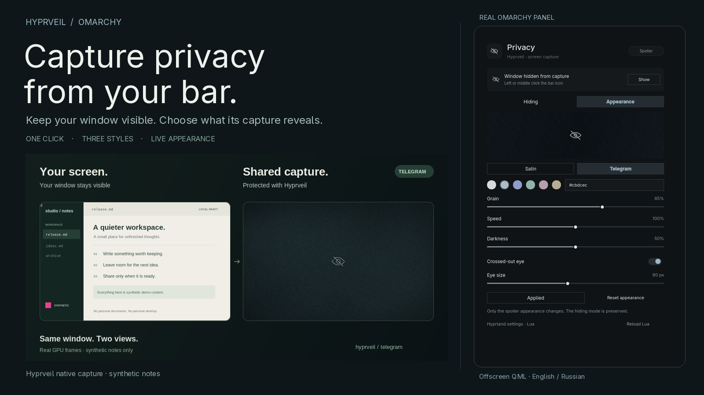
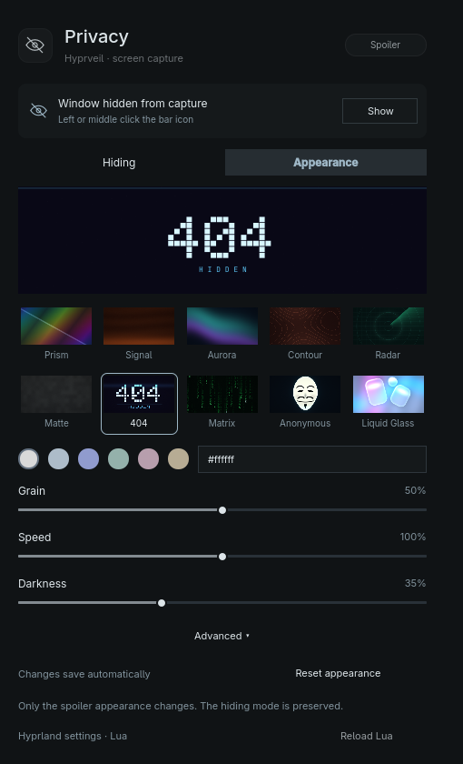
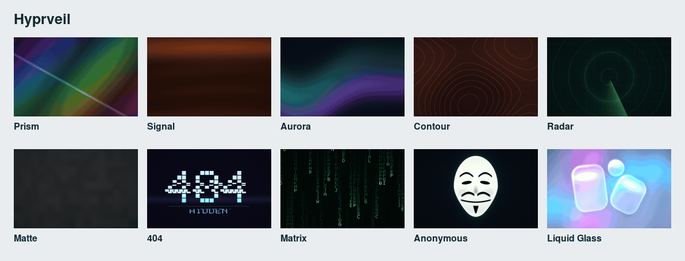

# Hyprveil for Omarchy

**Capture privacy, directly from your bar.**

Keep a window visible on your own screen while its compositor capture gets
an animated procedural mask, a black mask, or no window at all. One click controls
the focused window; a small panel controls the look.

<p align="center">
  
</p>

*Illustration of the privacy boundary. Actual native recordings and panel
screenshots appear below.*

<p align="center">
  <a href="https://github.com/OBJLAKO/omarchy-hyprveil/actions/workflows/tests.yml"></a>
  <a href="LICENSE"></a>
  
</p>

## Why two projects?

| Project | What it does |
| :--- | :--- |
| [**omarchy-hyprveil**](https://github.com/OBJLAKO/omarchy-hyprveil) — this repository | The Omarchy bar widget, confirmed privacy indicator and appearance controls. |
| [**hyprveil**](https://github.com/OBJLAKO/hyprveil) — required companion | The native Hyprland capture engine, CLI and Lua settings. Also works on plain Hyprland. |

The widget uses the native core's public API. Its first-click setup installs
the pinned core with Hyprpm; the core can also be installed independently.
You can star the
[panel](https://github.com/OBJLAKO/omarchy-hyprveil) and
[native core](https://github.com/OBJLAKO/hyprveil) to follow their independent releases.

## Install

Requires an Omarchy shell with third-party bar plugins, Python 3, `hyprpm`
and `hyprctl`. Setup installs **native Hyprveil 0.5.0**, which currently supports
**Hyprland 0.56.2 with its reviewed dependency ABI**. Other ABIs are refused.

Add the widget:

```sh
omarchy plugin add https://github.com/OBJLAKO/omarchy-hyprveil.git --enable
```

**Click the bar button to finish setup in a terminal.** The installer shows
its changes and asks before building the pinned native release with Hyprpm.
Build dependencies and headers may require `sudo`. A broader `hyprpm update`
needs separate consent: it can rebuild other repositories and unload manually
loaded plugins while synchronizing the compositor. Stop screen sharing while
setting up or rebuilding.

Ordinary setup adds backed-up, marked Lua startup and persistent settings, then
registers and activates only Hyprveil. No separate CLI is needed.
If native state cannot be confirmed, the click opens the panel for diagnostics
instead of starting setup. Protection starts after native loading is confirmed.
See the [setup steps, permissions and files](docs/GUIDE.md#installation).
If setup reports **prepared** but **not active yet**, its files are kept for a
new login; confirm native loading after logging back in before sharing.

**Upgrading from the old native installer?** Complete the native
[cold-login migration](https://github.com/OBJLAKO/hyprveil/blob/main/docs/HOST-SETUP.md#migrate-from-the-old-installer)
first so that two loaders do not manage the same module.

### Update and remove

Update the widget through Omarchy:

```sh
omarchy plugin update io.github.objlako.hyprveil
```

Updating the widget does not rebuild an already loaded native module. Follow
the [native update procedure](docs/GUIDE.md#update-and-remove) when needed.
To remove this widget:

```sh
omarchy plugin remove io.github.objlako.hyprveil
```

This removes the Omarchy integration. The native core, selective startup helper,
settings and private backups remain, so capture protection can continue after
login. Setup also installs `~/.local/share/omarchy-hyprveil/uninstall.sh` with
the same conservative behavior.

### Coming from `sky.hyprveil`

The permanent plugin ID is now `io.github.objlako.hyprveil`. Disable the old
entry before adding the current repository:

```sh
omarchy plugin disable sky.hyprveil
omarchy plugin add https://github.com/OBJLAKO/omarchy-hyprveil.git --enable
```

The old directory and helpers remain available. For an older custom or offline
installation, see the [migration guide](docs/GUIDE.md).

## A small panel, three capture styles

| Style | Protected window in a compositor capture |
| :--- | :--- |
| **Spoiler** | Ten opaque procedural presets, with an optional privacy icon. |
| **Black** | A plain opaque black mask. |
| **Omit** | The window is excluded from capture. |

**Left or middle click:** toggle the focused window's capture privacy.
**Right click:** open styles and appearance. The eye reflects confirmed
effective privacy, including inherited protection; a question mark marks
unconfirmed state.

Choose Prism, Signal, Aurora, Contour, Radar, Matte, 404, Matrix, Anonymous or Liquid Glass, then tune color, grain,
speed and darkness. Advanced settings offer an eye, lock or shield with size and icon opacity controls. Changes save automatically; there is no Apply button. Controls stay usable while saving, and the latest choice wins. Matte stays still. Background
checks preserve your edits and follow native changes to other fields. Managed Lua settings
persist; an independently installed core without managed Lua settings clearly
marks session-only changes. The UI defaults to **English**, with **Russian** for a Russian
system locale. [Controls and settings](docs/GUIDE.md#controls).

To choose a language explicitly, use `en`, `ru` or `auto`:

```sh
omarchy bar set io.github.objlako.hyprveil language en
```

<p align="center">
  
</p>

*Actual QML panel rendered offscreen with synthetic state.*

<p align="center">
  
</p>

*Actual native GPU captures of ten themes in an isolated synthetic test session.
No personal desktop or private window content is shown.*

## Capture scope

The panel reads no window pixels or titles. The native API checks focus and
stable window identity before changing privacy, and the indicator waits for
actual confirmation. A failed spoiler renderer falls back to black.

Protection applies to the compositor capture paths supported by Hyprveil.
**Direct DRM/KMS scanout capture bypasses that scene and is outside its scope.**
Your physical screen stays visible. Choose a supported recording backend
using the [native capture limits](https://github.com/OBJLAKO/hyprveil#know-the-boundary).

<details>
<summary>Tests and preview provenance</summary>

```sh
python3 -m unittest discover -s tests -v
node tests/state.test.cjs
python3 tests/qml-process-failures.py
python3 tests/qml-smoke.py --native-config
```

CI runs Python, JavaScript and executable Lua unit tests. QML and compositor
checks are local integration tests. Documentation rendering needs Omarchy,
Quickshell and Pillow:

```sh
python3 assets/render-previews.py
```

The cover is an explanatory SVG illustration. Panel screenshots use a temporary
HOME, an artificial controller and Qt offscreen. The native styles recording
comes from a separate, stopped synthetic compositor lab. No personal desktop
capture is used. Installer tests use temporary homes and fake manager commands;
they do not claim a live privileged Hyprpm installation or a cold-login test.
[Asset provenance](assets/provenance.json) · [Validation guide](docs/GUIDE.md#validation).

</details>
