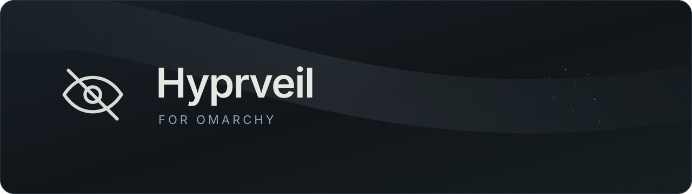

<p align="center">
  
</p>

<p align="center">
  <strong>Window privacy and spoiler styles, from your Omarchy bar.</strong>
</p>

<p align="center">
  <a href="https://github.com/OBJLAKO/omarchy-hyprveil/actions/workflows/tests.yml"></a>
  <a href="https://github.com/OBJLAKO/hyprveil"></a>
  
  <a href="LICENSE"></a>
</p>

A standalone control panel for [native Hyprveil](https://github.com/OBJLAKO/hyprveil).
Choose how protected windows appear in **compositor-based captures**, without
changing their appearance on your own screen. The native core also works on
ordinary Hyprland without this panel.

<p align="center">
  
</p>

*Real QML components, synthetic state. This loop shows the panel's procedural
preview; it is not a recording of native capture output.*

## Install

Requires **Omarchy shell**, **native Hyprveil 0.4.0**, Python 3 and `hyprctl`.
The native build is tested against **Hyprland 0.56.2** and must match the
compositor's ABI. Install [the native core and CLI](https://github.com/OBJLAKO/hyprveil)
first, then:

```sh
git clone https://github.com/OBJLAKO/omarchy-hyprveil.git
cd omarchy-hyprveil
python3 tools/install.py
```

The installer checks `~/.local/bin/hyprveil`, backs up existing widget files
and bar layout, and adds `sky.hyprveil` to your bar. Omarchy reloads the user
files automatically. To replace a previously installed version:

```sh
python3 tools/install.py --update
```

It preserves unrelated layout and keybindings. It does not load native code
or restart Hyprland. [Installation details and restore notes](plugin/README.md#installation).

## A small panel, three capture styles

| Style | Result for a protected window |
| :--- | :--- |
| **Spoiler** | An opaque synthetic surface: satin or Telegram-style grain. |
| **Black** | A plain opaque black mask. |
| **Omit** | The window is excluded from compositor capture. |

**Left or middle click:** show/hide the focused window. **Right click:** open
styles and appearance. The eye follows confirmed privacy state; unknown
state is shown honestly. Appearance changes keep the selected hiding mode.

<p align="center">
  
</p>

Tune color, grain, speed, darkness and the eye. Drafts survive background
checks, with no recurring loading flash. Settings use the native Lua
configuration; the panel also follows changes made outside it.
[Controls and settings](plugin/README.md#controls). The current UI is Russian;
the guide is in English.

## Safety boundary

This panel samples **no window pixels or titles**. It sends bounded identity
strings to the public native API and waits for actual state confirmation.
The native core checks focus and stable window identity before a change.
An unavailable spoiler renderer falls back to a black mask.

**Direct DRM/KMS scanout capture bypasses compositor privacy and is not
protected.** Physical displays and cameras remain outside this protection.
See the [native core's capture limits](https://github.com/OBJLAKO/hyprveil)
before choosing a recording backend.

<details>
<summary>Tests and demo provenance</summary>

```sh
python3 -m unittest discover -s tests -v
node plugin/tests/state.test.cjs
python3 plugin/tests/qml-smoke.py --native-config
```

CI runs Python, JavaScript and executable Lua unit tests. Compositor/QML
checks are local integration tests, not claimed by that CI badge. Preview
rendering additionally needs Omarchy, Quickshell and Pillow:

```sh
python3 assets/render-previews.py
```

The PNGs and sampled GIF come from an offscreen fixture, real QML components,
a temporary HOME and an artificial controller. No personal desktop capture
is used. [Validation guide](plugin/README.md#validation).

</details>
